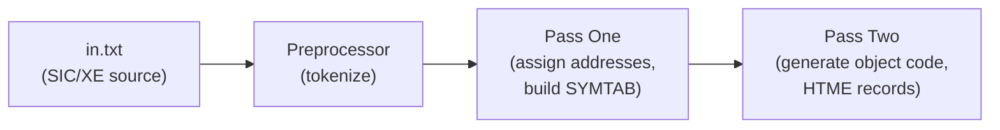

# Detailed Code Explanation — `preprocessor.py` & `pass_one.py`

> [!TIP]
> This document explains **every single line** of both files. Read it carefully before your TA discussion. Key TA questions are at the end.

---

## Big Picture: How the Assembler Works

This project implements a **two-pass SIC/XE assembler** with **program block support**. The pipeline is:



1. **Preprocessor** — reads raw text, strips comments, splits each line into tokens (label, mnemonic, operand)
2. **Pass One** — walks through tokens, assigns a location counter (address) to every instruction, builds the **symbol table** (SYMTAB) and **literal pool**
3. **Pass Two** — uses the symbol table from Pass One to generate actual machine object code

---

# Part 1: `preprocessor.py` — The Tokenizer

[Full file: preprocessor.py](file:///d:/1%29%20colloge/3%29%20TERM%206/SYSTEM%20PRO/System%20Programming/project/SYSTEMS%20PROJECT%20HESAHM/src/preprocessor.py)

## 1.1 Imports (Lines 1–2)

```python
from dataclasses import field, dataclass
from typing import Optional
```

- **`dataclass`**: A Python decorator that auto-generates `__init__`, `__repr__`, etc. for a class — saves boilerplate.
- **`field`**: Lets you specify default values for dataclass fields.
- **`Optional`**: Type hint meaning "this value can be `None`". `Optional[str]` = `str | None`.

---

## 1.2 The `ParsedLine` Data Class (Lines 4–17)

```python
@dataclass
class ParsedLine:
    line_no: int
    first: str
    second: Optional[str] = field(default=None)
    third: Optional[str] = field(default=None)
```

**What it is:** A structured representation of one line of assembly code **after tokenization**.

| Field | Type | Meaning | Example (for `ALPHA   WORD    5`) |
|-------|------|---------|-----------------------------------|
| `line_no` | `int` | The original line number in the source file (0-indexed) | `16` |
| `first` | `str` | The first token — always present | `"ALPHA"` |
| `second` | `Optional[str]` | The second token — may be `None` | `"WORD"` |
| `third` | `Optional[str]` | The third token — may be `None` | `"5"` |

**Why 3 fields?** In SIC/XE assembly, a line has **at most 3 parts**:
- **1 part**: Just a mnemonic → `RSUB`
- **2 parts**: Mnemonic + operand → `LDA ALPHA`, or Label + mnemonic → `FIRST RSUB`
- **3 parts**: Label + mnemonic + operand → `ALPHA WORD 5`

### The `number_of_parts` Property (Lines 11–17)

```python
@property
def number_of_parts(self) -> int:
    return (
        (self.first is not None)
        + (self.second is not None)
        + (self.third is not None)
    )
```

**What it does:** Returns how many tokens this line has (1, 2, or 3).

**How it works:** In Python, `True` equals `1` and `False` equals `0`. So:
- `(self.first is not None)` → always `1` (first is required)
- `(self.second is not None)` → `1` if present, `0` if `None`
- `(self.third is not None)` → `1` if present, `0` if `None`

Adding them gives 1, 2, or 3.

**Why it's needed:** Pass One uses `number_of_parts` to decide how to interpret the tokens — is the first token a label or a mnemonic? (see [_parse_instruction](file:///d:/1%29%20colloge/3%29%20TERM%206/SYSTEM%20PRO/System%20Programming/project/SYSTEMS%20PROJECT%20HESAHM/src/assembler/pass_one.py#L432-L518))

---

## 1.3 The `Preprocessor` Class (Lines 20–78)

### Constructor (Lines 21–22)

```python
class Preprocessor:
    def __init__(self) -> None:
        self.parsed_lines: list[ParsedLine] = []
```

Creates an empty list to store results. This is the Preprocessor's state — after calling `process()`, results live here.

---

### The `process()` Method (Lines 24–52) — THE CORE

```python
def process(self, input_lines: list[str]) -> list[ParsedLine]:
    result = []
    for i, line in enumerate(input_lines):
```

- **Input:** A list of raw strings (each string is one line from the `.txt` file).
- **`enumerate(input_lines)`:** Gives both the index `i` (line number) and the string `line`.

#### Step 1: Strip whitespace (Line 27)
```python
        line = line.strip()
```
Removes leading/trailing spaces and newline characters (`\n`, `\r`).

#### Step 2: Handle comments (Lines 29–35)
```python
        if "." in line:
            dot_idx = line.find(" .")
            if dot_idx != -1:
                line = line[:dot_idx]

            if line.lstrip().startswith("."):
                continue
```

In SIC/XE, **`.` (dot) marks a comment**.

- **Line 29:** Quick check — if there's no dot at all, skip the comment logic entirely (optimization).
- **Line 30:** `line.find(" .")` looks for ` .` (space then dot) — this catches **inline comments** like:  
  `LDA ALPHA  . load alpha into register A`
- **Line 31–32:** If found, chop off everything from the space-dot onward: `line[:dot_idx]` keeps only the code part.
- **Line 34–35:** If the line (after stripping leading spaces) starts with `.`, it's a **full-line comment** → `continue` skips it entirely.

> [!IMPORTANT]
> The order matters: first remove inline comments, THEN check if the remaining line is a full comment. This handles edge cases like a line that is only a comment.

#### Step 3: Split into tokens (Lines 38–40)
```python
        split_line = line.split()
        if not split_line:
            continue
```

- `line.split()` splits by **any whitespace** and removes empty strings. Example:  
  `"ALPHA   WORD    5"` → `["ALPHA", "WORD", "5"]`
- If the result is empty (blank line or line that became blank after comment removal), skip it.

#### Step 4: Build a `ParsedLine` (Lines 42–49)
```python
        new_parsed_line = ParsedLine(
            line_no=i,
            first=split_line[0],
            second=split_line[1] if len(split_line) > 1 else None,
            third=split_line[2] if len(split_line) > 2 else None,
        )

        result.append(new_parsed_line)
```

- `first` = first token (always exists because we checked `if not split_line`)
- `second` = second token if it exists, otherwise `None`
- `third` = third token if it exists, otherwise `None`
- **Anything beyond 3 tokens is ignored.** This is intentional — SIC/XE syntax never needs more than 3 fields.

#### Step 5: Store and return (Lines 51–52)
```python
    self.parsed_lines = result
    return result
```

Saves the parsed lines to `self.parsed_lines` (for later export) AND returns them directly.

---

### The `export_to_file()` Method (Lines 54–78)

```python
def export_to_file(self, output_path: str) -> None:
    header = f"{'Line':<8}{'First':<12}{'Second':<12}{'Third'}"
    separator = "-" * 45
```

- Creates a formatted header row with fixed-width columns using Python f-string alignment:
  - `{'Line':<8}` means left-align `"Line"` in an 8-character-wide field

```python
    try:
        with open(output_path, "w") as f:
            f.write(header + "\n")
            f.write(separator + "\n")

            for line in self.parsed_lines:
                l_no = str(line.line_no)
                lbl = line.first or ""
                opc = line.second or ""
                opr = line.third or ""

                formatted_row = f"{l_no:<8}{lbl:<12}{opc:<12}{opr}"
                f.write(formatted_row.rstrip() + "\n")

        print(f"Successfully exported {len(self.parsed_lines)} lines to {output_path}")

    except IOError as e:
        print(f"Failed to write export file: {e}")
```

- **`line.first or ""`**: If `line.first` is `None`, use empty string (for clean printing).
- **`.rstrip()`**: Removes trailing whitespace from each row.
- **`IOError`**: Catches file-system errors (permission denied, disk full, etc.).

**Output looks like:**
```
Line    First       Second      Third
---------------------------------------------
0       COPY        START       0
1       FIRST       CLEAR       X
2       CLEAR       A
...
```

---

# Part 2: `pass_one.py` — First Pass of the Assembler

[Full file: pass_one.py](file:///d:/1%29%20colloge/3%29%20TERM%206/SYSTEM%20PRO/System%20Programming/project/SYSTEMS%20PROJECT%20HESAHM/src/assembler/pass_one.py)

## 2.1 What Pass One Does (Theory)

Pass One's job is to:
1. **Assign an address (location counter) to every instruction**
2. **Build the symbol table (SYMTAB)** — mapping every label to its address
3. **Handle program blocks** (`USE` directive) — multiple memory regions
4. **Collect literals** (`&C'EOF'`, `&X'0F'`) into a literal pool

It does **NOT** generate any machine code — that's Pass Two's job.

---

## 2.2 Imports (Lines 1–26)

```python
from typing import Optional, cast

from instruction_set import (
    MemoryBlock,        # Enum: DEFAULT, DEFAULTB, CDATA, CBLKS, POOL
    InstructionFormat,  # Enum: FORMAT_1, FORMAT_2, FORMAT_3, FORMAT_4, DIRECTIVE
    is_directive,       # checks if a token is a directive (START, END, BYTE, etc.)
    is_supported,       # checks if a token is a valid opcode OR directive
    is_format4,         # checks if mnemonic starts with "+"
    lookup_opcode,      # returns OpcodeInfo (opcode hex, format) for a mnemonic
)
from preprocessor import ParsedLine  # the tokenized line from the preprocessor
from assembler_errors import (
    DuplicateSymbolError,           # raised when a label is defined twice
    InvalidDirectiveOperandError,   # raised for bad directive operands (e.g., RESW -5)
    InvalidMnemonicOrDirective,     # raised for unrecognized instructions
    UnidentifiedBlockNameError,     # raised for invalid USE block names
)

from . import (                     # from assembler/__init__.py
    AssemblyInstruction,            # base class for all instructions
    DirectiveInstruction,           # for START, END, BYTE, WORD, RESW, RESB, USE, etc.
    Format1Instruction,             # 1-byte instructions (e.g., FIX, FLOAT)
    Format2Instruction,             # 2-byte instructions (e.g., CLEAR, ADDR)
    Format3Instruction,             # 3-byte instructions (e.g., LDA, STA)
    Format4Instruction,             # 4-byte instructions (e.g., +LDX)
)
```

- **`cast`**: A type-hinting function. `cast(DirectiveInstruction, x)` tells Python "treat `x` as type `DirectiveInstruction`". It does **nothing at runtime** — purely for type checkers.

---

## 2.3 Class-Level Constants (Lines 29–41)

```python
class AssemblerPassOne:
    _USER_BLOCKS: tuple[MemoryBlock, ...] = (
        MemoryBlock.DEFAULT,
        MemoryBlock.DEFAULTB,
        MemoryBlock.CDATA,
        MemoryBlock.CBLKS,
    )
```

**The 4 user-accessible program blocks.** In SIC/XE, `USE` lets you switch between memory regions:
- `DEFAULT` — code goes here by default
- `DEFAULTB` — a secondary code block
- `CDATA` — for constant data (e.g., `WORD`, `BYTE`)
- `CBLKS` — for reserved storage blocks (e.g., `RESB`, `RESW`)

```python
    _USE_BLOCK_MAP: dict[str, MemoryBlock] = {
        MemoryBlock.DEFAULT.value: MemoryBlock.DEFAULT,     # "DEFAULT" -> DEFAULT
        MemoryBlock.DEFAULTB.value: MemoryBlock.DEFAULTB,   # "DEFAULTB" -> DEFAULTB
        MemoryBlock.CDATA.value: MemoryBlock.CDATA,         # "CDATA" -> CDATA
        MemoryBlock.CBLKS.value: MemoryBlock.CBLKS,         # "CBLKS" -> CBLKS
    }
```

A lookup table: maps the **string name** written in the `USE` directive to the corresponding `MemoryBlock` enum.

---

## 2.4 Constructor `__init__` (Lines 43–62)

```python
def __init__(self) -> None:
    # Location counters — one per block. Each block has its own address space.
    self.default_block_loc = 0       # current address in DEFAULT block
    self.default_b_block_loc = 0     # current address in DEFAULTB block
    self.cdata_block_loc = 0         # current address in CDATA block
    self.cblocks_block_loc = 0       # current address in CBLKS block
    self.pool_block_loc = 0          # current address in POOL block (for literals)

    # Symbol tables — one per block. Maps label_name -> address_in_that_block
    self.default_block_symtab: dict[str, int] = {}
    self.default_b_block_symtab: dict[str, int] = {}
    self.cdata_block_symtab: dict[str, int] = {}
    self.cblocks_block_symtab: dict[str, int] = {}
    self.pool_block_symtab: dict[str, int] = {}

    # The final list of parsed instructions (with addresses assigned)
    self.instructions: list[AssemblyInstruction] = []
    self.start_address = 0           # address from the START directive
    self.program_name = ""           # label from the START directive

    # Literal pool management
    self._pending_literals: list[str] = []     # literals waiting to be assigned addresses
    self._pending_literals_set: set[str] = set()  # for O(1) duplicate checking
    self._pool_anchor_block: Optional[MemoryBlock] = None  # which block the pool sits in
```

> [!IMPORTANT]
> **Why separate location counters per block?** Each program block has its own independent address space. When you `USE CDATA`, the location counter for DEFAULT is "frozen" and the CDATA counter continues. When you `USE DEFAULT` again, you pick up where DEFAULT left off.

> [!NOTE]
> **Why both a list AND a set for pending literals?** The list preserves **insertion order** (so literals appear in the pool in the order they were first used). The set provides **O(1) duplicate checking** (so we don't add the same literal twice).

---

## 2.5 Block Access Helpers (Lines 64–107)

These three methods abstract away the `match/case` logic for accessing per-block data:

### `_block_symtab(block)` (Lines 64–77)
```python
def _block_symtab(self, block: MemoryBlock) -> dict[str, int]:
    match block:
        case MemoryBlock.DEFAULT:   return self.default_block_symtab
        case MemoryBlock.DEFAULTB:  return self.default_b_block_symtab
        case MemoryBlock.CDATA:     return self.cdata_block_symtab
        case MemoryBlock.CBLKS:     return self.cblocks_block_symtab
        case MemoryBlock.POOL:      return self.pool_block_symtab
        case _: raise ValueError(...)
```
**Returns the symbol table dictionary for the given block.** If you pass `MemoryBlock.CDATA`, you get back `self.cdata_block_symtab`.

### `_get_block_loc(block)` (Lines 79–92)
Same pattern — returns the **current location counter** for the given block.

### `_set_block_loc(block, value)` (Lines 94–107)
Same pattern — **sets** the location counter for the given block to `value`.

**Why not use a dictionary?** A dictionary would be simpler (`self.locs = {MemoryBlock.DEFAULT: 0, ...}`). This approach uses separate variables, which is more verbose but makes each counter a named attribute (easier to debug/inspect).

---

## 2.6 USE Block Resolution (Lines 109–123)

```python
def _resolve_use_block(
    self, operand: Optional[str], program_counter: int, line_no: int
) -> MemoryBlock:
    if operand is None:
        return MemoryBlock.DEFAULT

    block = self._USE_BLOCK_MAP.get(operand.upper())
    if block is None:
        expected = ", ".join(self._USE_BLOCK_MAP)
        raise UnidentifiedBlockNameError(...)
    return block
```

**What it does:** When the assembler encounters `USE CDATA`, this method converts the string `"CDATA"` to `MemoryBlock.CDATA`.

- If `USE` has **no operand** (just `USE` by itself), it defaults back to `MemoryBlock.DEFAULT`.
- If the operand is invalid (e.g., `USE FOOBAR`), it throws an error listing the valid block names.

---

## 2.7 Instruction Location Setting (Lines 125–134)

```python
def _set_instruction_location(
    self, instruction: AssemblyInstruction, block: MemoryBlock, location: int
) -> None:
    instruction.block = block
    instruction.location_counter = location
```
Stamps an instruction with **which block** it belongs to and **what address** it's at.

```python
def _get_instruction_label_operand(
    self, instruction: AssemblyInstruction
) -> tuple[Optional[str], Optional[str]]:
    return getattr(instruction, "label", None), getattr(instruction, "operand", None)
```
Safely extracts the `label` and `operand` from any instruction type. Uses `getattr` because `Format1Instruction` doesn't have an `operand` field.

---

## 2.8 Symbol Table Operations (Lines 136–164)

### `_lookup_symbol(symbol)` (Lines 136–141)
```python
def _lookup_symbol(self, symbol: str) -> Optional[int]:
    for block in (*self._USER_BLOCKS, MemoryBlock.POOL):
        symtab = self._block_symtab(block)
        if symbol in symtab:
            return symtab[symbol]
    return None
```
**Searches ALL symbol tables** (all 4 user blocks + the pool block) for a symbol. Returns the address if found, `None` otherwise.

### `_lookup_symbol_entry(symbol)` (Lines 143–148)
Same as above but also returns **which block** the symbol was found in: `(block, address)`.

### `_add_symbol(symbol, block, value, ...)` (Lines 150–164)
```python
def _add_symbol(self, symbol, block, value, program_counter, line_no):
    if self._lookup_symbol_entry(symbol) is not None:
        raise DuplicateSymbolError(...)
    self._block_symtab(block)[symbol] = value
```
1. **Check for duplicates** across ALL blocks — a symbol can only be defined once in the entire program.
2. If not a duplicate, **add it** to the symbol table of the specified block.

> [!WARNING]
> Duplicate symbols are an assembler error. If your source has `ALPHA WORD 5` twice, this raises `DuplicateSymbolError`.

---

## 2.9 Expression Evaluation (Lines 166–247)

These methods handle operands that can be numbers, symbols, or simple expressions like `ALPHA+3`.

### `_try_parse_int(token)` (Lines 166–173)
```python
def _try_parse_int(self, token: str) -> Optional[int]:
    cleaned = token.strip()
    if not cleaned:
        return None
    try:
        return int(cleaned, 0)  # base 0 = auto-detect (decimal, hex 0x, octal 0o, binary 0b)
    except ValueError:
        return None
```
Tries to parse a string as an integer. `int(x, 0)` is clever — it auto-detects the base from prefixes like `0x` (hex), `0o` (octal), `0b` (binary).

### `_resolve_term(term, current_loc, line_no)` (Lines 175–196)
```python
def _resolve_term(self, term: str, current_loc: int, line_no: int) -> int:
    cleaned = term.strip()
    while cleaned.startswith(("#", "@")):   # strip addressing-mode prefixes
        cleaned = cleaned[1:]
    if cleaned.endswith(",X"):              # strip indexed addressing suffix
        cleaned = cleaned[:-2]
    if cleaned == "*":                      # "*" means current location counter
        return current_loc

    parsed_number = self._try_parse_int(cleaned)
    if parsed_number is not None:
        return parsed_number

    symbol_value = self._lookup_symbol(cleaned)
    if symbol_value is not None:
        return symbol_value

    raise InvalidDirectiveOperandError(...)
```

Resolves a **single term** to a numeric value:
1. Strip SIC/XE addressing prefixes: `#` (immediate), `@` (indirect)
2. Strip `,X` (indexed addressing)
3. `*` → current location counter value
4. Try parsing as a number
5. Try looking up as a symbol in SYMTAB
6. If all fail → error

### `_evaluate_expression(expr, ...)` (Lines 198–224)
```python
def _evaluate_expression(self, expr: str, current_loc: int, line_no: int) -> int:
    expression = expr.replace(" ", "")
    # ... find first + or - operator (skipping position 0 to handle negative numbers)
    if op_idx == -1:
        return self._resolve_term(expression, current_loc, line_no)

    lhs = expression[:op_idx]
    rhs = expression[op_idx + 1:]
    left_value = self._resolve_term(lhs, current_loc, line_no)
    right_value = self._resolve_term(rhs, current_loc, line_no)
    return left_value + right_value if operator == "+" else left_value - right_value
```

Handles simple **two-term expressions** like `ALPHA+3` or `BETA-1`:
- Finds the first `+` or `-` (starting from position 1 to avoid treating a negative sign as an operator)
- Splits into left-hand side and right-hand side
- Resolves each term independently and applies the operator

> [!NOTE]
> This only supports **one operator** (no chained expressions like `A+B+C`). This is sufficient for SIC/XE.

### `_parse_required_non_negative_operand(...)` (Lines 226–247)
Wrapper for directives like `RESW` and `RESB` that require a **non-negative integer operand**. Calls `_evaluate_expression`, then validates the result is ≥ 0.

---

## 2.10 BYTE Operand Size Calculation (Lines 249–282)

```python
def _byte_operand_size(self, operand, program_counter, line_no) -> int:
    cleaned = operand.strip()
    if len(cleaned) >= 3 and cleaned[1] == "'" and cleaned.endswith("'"):
        kind = cleaned[0].upper()
        payload = cleaned[2:-1]
        if kind == "C":
            return len(payload)       # character constant: 1 byte per character
        if kind == "X":
            if len(payload) % 2 != 0:
                raise ...             # hex must have even digits
            return len(payload) // 2  # hex constant: 2 hex digits = 1 byte

    parsed_number = self._try_parse_int(cleaned)
    if parsed_number is not None:
        return 1                      # plain number: 1 byte
```

Calculates **how many bytes** a `BYTE` directive occupies:
- `BYTE C'EOF'` → 3 bytes (one per character: E, O, F)
- `BYTE X'0F1A'` → 2 bytes (every 2 hex digits = 1 byte)
- `BYTE 5` → 1 byte

This is needed because the location counter must advance by the correct amount.

---

## 2.11 Literal Size Calculation (Lines 284–312)

```python
def _literal_size(self, literal, program_counter, line_no) -> int:
    token = literal[1:] if literal.startswith("&") else literal  # strip the & prefix
    # ... same logic as _byte_operand_size ...
    # except plain numbers default to 3 bytes (WORD-sized)
```

Same as `_byte_operand_size` but for **literals** (prefixed with `&` in this project):
- `&C'EOF'` → 3 bytes
- `&X'0F'` → 1 byte
- `&5` → 3 bytes (stored as a WORD)

> [!NOTE]
> In standard SIC/XE textbooks, literals use `=` prefix (e.g., `=C'EOF'`). This project uses `&` instead.

---

## 2.12 Literal Pool Management (Lines 314–337)

### `_collect_literals(operand, block)` (Lines 314–327)
```python
def _collect_literals(self, operand: Optional[str], block: MemoryBlock) -> None:
    if operand is None:
        return
    for raw in operand.split(","):
        token = raw.strip()
        if not token.startswith("&"):
            continue                          # not a literal
        if self._pool_anchor_block is None:
            self._pool_anchor_block = block   # remember which block triggered first literal
        if token in self.pool_block_symtab or token in self._pending_literals_set:
            continue                          # already known — skip duplicate
        self._pending_literals.append(token)
        self._pending_literals_set.add(token)
```

Called for every instruction. Scans the operand for **literal references** (tokens starting with `&`):
- Splits by comma to handle indexed addressing like `&X'0F',X`
- Records the **first block** that uses a literal (`_pool_anchor_block`) — Pass Two needs this to know where to place the literal pool
- Adds new literals to the pending list (avoiding duplicates)

### `_flush_literal_pool(line_no)` (Lines 329–337)
```python
def _flush_literal_pool(self, line_no: int) -> None:
    for literal in self._pending_literals:
        self.pool_block_symtab[literal] = self.pool_block_loc
        self.pool_block_loc += self._literal_size(literal, self.pool_block_loc, line_no)
    self._pending_literals.clear()
    self._pending_literals_set.clear()
```

**Assigns addresses** to all pending literals:
1. For each literal, record its address in `pool_block_symtab` (the literal pool's symbol table)
2. Advance `pool_block_loc` by the literal's size
3. Clear the pending lists

This is called when `END` is encountered (or at the very end of the program).

---

## 2.13 START Directive Handling (Lines 339–367)

### `_is_start_directive(instruction)` (Lines 339–343)
Returns `True` if the instruction is a `DirectiveInstruction` with directive name `"START"`.

### `_handle_start_directive(instruction, line_no)` (Lines 345–367)
```python
def _handle_start_directive(self, instruction: DirectiveInstruction, line_no: int) -> MemoryBlock:
    start_value = 0
    if instruction.operand is not None:
        start_value = int(instruction.operand)    # e.g., START 0 → start_value = 0

    self.start_address = start_value              # save for Pass Two
    if instruction.label is not None:
        self.program_name = instruction.label      # e.g., COPY START 0 → program_name = "COPY"
    self._set_block_loc(MemoryBlock.DEFAULT, start_value)
    self._set_instruction_location(instruction, MemoryBlock.DEFAULT, start_value)

    if instruction.label is not None:
        self._add_symbol(instruction.label, MemoryBlock.DEFAULT, start_value, ...)

    return MemoryBlock.DEFAULT
```

For `COPY START 0`:
1. Sets starting address to `0`
2. Saves program name as `"COPY"`
3. Sets DEFAULT block's location counter to `0`
4. Adds `COPY` to the symbol table at address `0`
5. Returns `MemoryBlock.DEFAULT` as the active block

---

## 2.14 Directive Processing (Lines 369–416) — `_process_directive_pass_one`

This is the **heart of directive handling** in Pass One:

```python
def _process_directive_pass_one(self, instruction, block_for_line, line_loc, line_no, current_block):
    directive = instruction.directive.upper()

    # If there's a label, add it to the symbol table
    if instruction.label is not None:
        self._add_symbol(instruction.label, block_for_line, line_loc, ...)

    # Collect any literals from the operand
    self._collect_literals(instruction.operand, block_for_line)

    if directive == "USE":
        return self._resolve_use_block(instruction.operand, line_loc, line_no)
    if directive == "WORD":
        self._set_block_loc(block_for_line, line_loc + 3)       # WORD = 3 bytes
    elif directive == "RESW":
        words = self._parse_required_non_negative_operand(...)
        self._set_block_loc(block_for_line, line_loc + (3 * words))  # RESW n = 3*n bytes
    elif directive == "RESB":
        bytes_count = self._parse_required_non_negative_operand(...)
        self._set_block_loc(block_for_line, line_loc + bytes_count)  # RESB n = n bytes
    elif directive == "BYTE":
        byte_size = self._byte_operand_size(...)
        self._set_block_loc(block_for_line, line_loc + byte_size)
    elif directive == "END":
        self._flush_literal_pool(line_no)     # dump all pending literals

    return current_block
```

| Directive | Action | LC Advance |
|-----------|--------|------------|
| `USE` | Switch active block | 0 (just switches) |
| `WORD` | Reserve 1 word | +3 bytes |
| `RESW n` | Reserve n words | +3n bytes |
| `RESB n` | Reserve n bytes | +n bytes |
| `BYTE` | Store constant | +size of constant |
| `END` | End of program | 0 (but flushes literal pool) |
| `START` | Handled separately | set to operand value |
| `BASE`, `NOBASE`, `EXTDEF`, `EXTREF` | No LC change | 0 |

---

## 2.15 Machine Instruction Processing (Lines 418–430)

```python
def _process_machine_instruction_pass_one(self, instruction, block_for_line, line_loc, line_no):
    label, operand = self._get_instruction_label_operand(instruction)
    if label is not None:
        self._add_symbol(label, block_for_line, line_loc, line_loc, line_no)

    self._collect_literals(operand, block_for_line)
    self._set_block_loc(block_for_line, line_loc + instruction.size)
```

For machine instructions (`LDA`, `STA`, `CLEAR`, `+LDX`, etc.):
1. If it has a label → add to SYMTAB
2. If its operand references a literal → collect it
3. Advance the location counter by `instruction.size` (1, 2, 3, or 4 bytes depending on format)

---

## 2.16 Instruction Parsing (Lines 432–518) — `_parse_instruction`

This is the **lexical analysis** — converting a `ParsedLine` (tokens) into a typed `AssemblyInstruction`:

```python
def _parse_instruction(self, line: ParsedLine, current_block_loc: int = 0) -> AssemblyInstruction:
    label = None
    mnemonic = None
    operand = None
```

### Case: 1 token (Line 439–440)
```python
    if line.number_of_parts == 1:
        mnemonic = line.first          # e.g., "RSUB"
```
Only a mnemonic, no label or operand.

### Case: 2 tokens (Lines 441–454)
```python
    elif line.number_of_parts == 2:
        if is_supported(line.first):       # Is the 1st token a known mnemonic?
            mnemonic = line.first          # e.g., "LDA" "#0"  →  mnemonic=LDA, operand=#0
            operand = line.second
        elif is_supported(line.second):    # Is the 2nd token a known mnemonic?
            label = line.first             # e.g., "FIRST" "RSUB"  →  label=FIRST, mnemonic=RSUB
            mnemonic = line.second
        else:
            raise InvalidMnemonicOrDirective(...)  # Neither is valid
```

**This is a critical disambiguation step.** With 2 tokens, it could be:
- `mnemonic operand` (e.g., `LDA ALPHA`)
- `label mnemonic` (e.g., `FIRST RSUB`)

The code checks which token is a recognized instruction to decide.

### Case: 3 tokens (Lines 455–459)
```python
    else:  # 3 parts
        label = line.first
        mnemonic = line.second
        operand = line.third               # e.g., "ALPHA" "WORD" "5"
```
Unambiguous: `label mnemonic operand`.

### Building the typed instruction (Lines 461–518)
```python
    if not mnemonic or not is_supported(mnemonic):
        raise InvalidMnemonicOrDirective(...)

    if mnemonic.upper() == "USE":
        self._resolve_use_block(operand, ...)   # validate the block name early

    if is_directive(mnemonic):
        return DirectiveInstruction(parsed_line=line, size=0, label=label,
                                    directive=mnemonic, operand=operand)

    opcode_info = lookup_opcode(mnemonic)
    if opcode_info is not None:
        if is_format4(mnemonic):                      # starts with "+"
            return Format4Instruction(size=4, ...)
        if opcode_info.fmt == InstructionFormat.FORMAT_1:
            return Format1Instruction(size=1, ...)
        if opcode_info.fmt == InstructionFormat.FORMAT_2:
            return Format2Instruction(size=2, ...)
        if opcode_info.fmt == InstructionFormat.FORMAT_3:
            return Format3Instruction(size=3, ...)
```

Decision tree:
1. Is it a directive? → `DirectiveInstruction` (size = 0, directives don't generate code directly)
2. Does it start with `+`? → `Format4Instruction` (size = 4)
3. Check opcode format from the opcode table → `Format1` (1), `Format2` (2), or `Format3` (3)

---

## 2.17 The Main Loop — `process_pass_one()` (Lines 520–559)

```python
def process_pass_one(self, parsed_lines: list[ParsedLine]) -> None:
    current_block = MemoryBlock.DEFAULT           # start in DEFAULT block

    for line in parsed_lines:
        current_block_loc = self._get_block_loc(current_block)  # get LC for active block
        instruction = self._parse_instruction(line, current_block_loc)

        # Special case: START directive
        if self._is_start_directive(instruction):
            current_block = self._handle_start_directive(cast(...), line.line_no)
            self.instructions.append(instruction)
            continue

        # Assign location to this instruction
        block_for_line = current_block
        line_loc = self._get_block_loc(block_for_line)
        self._set_instruction_location(instruction, block_for_line, line_loc)

        # Process based on type
        if isinstance(instruction, DirectiveInstruction):
            current_block = self._process_directive_pass_one(
                instruction, block_for_line, line_loc, line.line_no, current_block)
        else:
            self._process_machine_instruction_pass_one(
                instruction, block_for_line, line_loc, line.line_no)

        self.instructions.append(instruction)

    # If there are unflushed literals at the end, flush them now
    if self._pending_literals:
        fallback_line_no = parsed_lines[-1].line_no if parsed_lines else 0
        self._flush_literal_pool(fallback_line_no)
```

**Step by step for each line:**
1. Get the current location counter for the active block
2. Parse the line into a typed instruction
3. If it's `START`, handle it specially and move on
4. Otherwise, stamp the instruction with its block + address
5. If directive → process directive (may switch blocks, advance LC)
6. If machine instruction → add label to SYMTAB, advance LC by instruction size
7. Append to the instruction list

**After the loop:** If any literals haven't been flushed yet (no `END` directive, or `END` was somehow skipped), flush them.

---

## 2.18 Export Methods (Lines 561–628)

### `export_symbol_table(output_path)` (Lines 561–571)
Writes the symbol table to a file:
```
Symbol      Block     LC (HEX)  LC (DEC)
------------------------------------------
COPY        DEFAULT   0000         0
FIRST       DEFAULT   0000         0
ALPHA       CDATA     0000         0
...
```

### `export_pool_table(output_path)` (Lines 573–581)
Writes the literal pool to a file:
```
Literal     LC (HEX)  LC (DEC)
----------------------------------
&C'EOF'     0000         0
&X'0F'      0003         3
```

### `export_intermediate_table(output_path)` (Lines 583–610)
Writes the intermediate file (all instructions with their assigned addresses):
```
Location counter  Symbol   Instructions  Reference
----------------  -------  ------------  ----------
0000              COPY     START         0
0000              FIRST    CLEAR         X
...
```

### Properties (Lines 612–628)
- **`block_locs`** — returns a dictionary of all block location counters (used by Pass Two to calculate absolute addresses)
- **`symbol_tables`** — returns copies of all symbol tables (used by Pass Two)
- **`pool_anchor_block`** — returns which block the literal pool is anchored to

---

## Walkthrough: Processing `in.txt`

Let's trace through the [sample input](file:///d:/1%29%20colloge/3%29%20TERM%206/SYSTEM%20PRO/System%20Programming/project/SYSTEMS%20PROJECT%20HESAHM/in.txt):

| Line | Source | Block | LC | Action |
|------|--------|-------|-----|--------|
| `COPY START 0` | START directive | DEFAULT | 0000 | Set start=0, add COPY→0 to SYMTAB |
| `FIRST CLEAR X` | Format 2 (2 bytes) | DEFAULT | 0000 | Add FIRST→0 to SYMTAB, LC→0002 |
| `CLEAR A` | Format 2 (2 bytes) | DEFAULT | 0002 | LC→0004 |
| `USE DEFAULTB` | Directive | — | — | Switch to DEFAULTB block |
| `LDA #0` | Format 3 (3 bytes) | DEFAULTB | 0000 | LC→0003 |
| `LDB #BASEVAL` | Format 3 (3 bytes) | DEFAULTB | 0003 | LC→0006 |
| `BASE BASEVAL` | Directive | DEFAULTB | 0006 | No LC change |
| `LDA ALPHA` | Format 3 (3 bytes) | DEFAULTB | 0006 | LC→0009 |
| `ADD &C'EOF'` | Format 3 (3 bytes) | DEFAULTB | 0009 | Collect literal `&C'EOF'`, LC→000C |
| `STA BETA` | Format 3 (3 bytes) | DEFAULTB | 000C | LC→000F |
| `LDA @GAMMA` | Format 3 (3 bytes) | DEFAULTB | 000F | LC→0012 |
| `+LDX ALPHA` | Format 4 (4 bytes) | DEFAULTB | 0012 | LC→0016 |
| `ADD &X'0F'` | Format 3 (3 bytes) | DEFAULTB | 0016 | Collect literal `&X'0F'`, LC→0019 |
| `STCH GAMMA,X` | Format 3 (3 bytes) | DEFAULTB | 0019 | LC→001C |
| `RSUB` | Format 3 (3 bytes) | DEFAULTB | 001C | LC→001F |
| `USE CDATA` | Directive | — | — | Switch to CDATA block |
| `ALPHA WORD 5` | Directive (3 bytes) | CDATA | 0000 | Add ALPHA→0 to CDATA SYMTAB, LC→0003 |
| `BETA RESW 1` | Directive (3 bytes) | CDATA | 0003 | Add BETA→3 to CDATA SYMTAB, LC→0006 |
| `BASEVAL WORD 4096` | Directive (3 bytes) | CDATA | 0006 | Add BASEVAL→6 to CDATA SYMTAB, LC→0009 |
| `USE CBLKS` | Directive | — | — | Switch to CBLKS block |
| `GAMMA RESB 5376` | Directive (5376 bytes) | CBLKS | 0000 | Add GAMMA→0 to CBLKS SYMTAB, LC→1500 |
| `END FIRST` | Directive | CBLKS | 1500 | Flush literal pool |

**Literal Pool after flush:**
| Literal | Address in POOL |
|---------|----------------|
| `&C'EOF'` | 0000 (3 bytes) |
| `&X'0F'` | 0003 (1 byte) |

---

## Potential TA Discussion Questions

### Q1: Why is a two-pass assembler needed? Can't we do it in one pass?
**A:** Forward references (using a symbol before it's defined, like `LDB #BASEVAL` when `BASEVAL` is defined later). Pass One builds the symbol table so Pass Two can resolve all references.

### Q2: What is the purpose of program blocks (USE directive)?
**A:** They allow logically separating code, data, and reserved storage while keeping them in one source file. The assembler assigns relative addresses within each block, then Pass Two calculates absolute addresses by stacking blocks.

### Q3: How does the preprocessor handle comments?
**A:** Two types: (1) full-line comments starting with `.` are skipped entirely, (2) inline comments (` .` pattern) are stripped from the end of the line.

### Q4: What's the difference between literals and immediate operands?
**A:** Immediate (`#5`) embeds the value in the instruction. Literals (`&C'EOF'`) allocate memory in the literal pool to store the value, and the instruction references that memory address.

### Q5: How does _parse_instruction disambiguate 2-token lines?
**A:** It checks if the first token is a valid mnemonic/directive. If yes → `mnemonic operand`. If not, checks if the second token is valid → `label mnemonic`. If neither is valid → error.

### Q6: Why separate symbol tables per block?
**A:** Each block has its own address space starting from 0. A symbol's address is relative to its block. Pass Two calculates the absolute address by adding the block's starting offset.

### Q7: What happens if a symbol is defined twice?
**A:** `_add_symbol` calls `_lookup_symbol_entry` which searches ALL blocks. If found anywhere, it raises `DuplicateSymbolError`. This prevents the same label from being used in different blocks too.

### Q8: When is the literal pool flushed?
**A:** Primarily when `END` is encountered (line 414). Also as a safety net at the end of `process_pass_one()` if there are still unflushed literals (lines 557–559).
